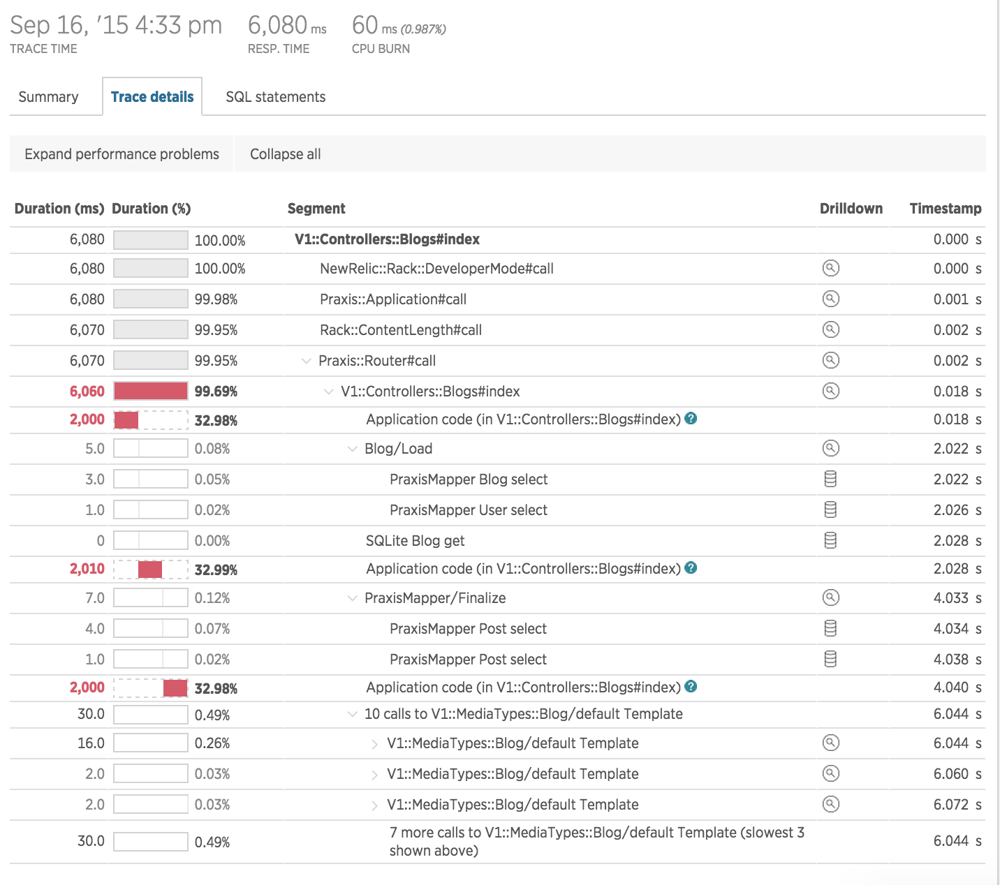

# Praxis New Relic Support

New Relic instrumentation for Praxis, Praxis Blueprints, and Praxis Mapper.



## Getting Started

Add the gem to your Gemfile:
```ruby
gem 'newrelic-praxis'
```

Require the gem and start the New Relic agent normally.

For example, you could use a simple initializer like `config/initializers/init_newrelic.rb`:
```ruby
require 'newrelic_rpm'
require 'newrelic-praxis'

NewRelic::Agent.manual_start
```

## What Is Instrumented

This gem provides separate instrumentation for Praxis, Praxis Blueprints, and Praxis Mapper. It uses the existing [notifications](http://praxis-framework.io/reference/plugins/notifications/) provided by Praxis where available, and injects additional New Relic-specific instrumentation to Praxis Mapper.

### Praxis

With this gem, you'll have three different traces with each request:

  * `Praxis::Application#call` -- your full Praxis app, starting from the `run Praxis::Application.instance` in your `config.ru`. This will include any Rack middleware you've specified in the application configuration, not any prior to that `run`.
  * `Praxis::Router#call` -- request handling inside Praxis. This includes all of the request stages (i.e. param/payload parsing, validation, the action, and etc.), with their `before`, `after`, and `around` filters.
  * `ControllerClass#action_method` -- traces *just* the action code in a Controller, without including any filters. This is done by subscribing to the `'praxis.request_stage.execute'` event with `ActiveSupport::Notifications`.


### Praxis::Blueprint

Reports rendering time for all `Praxis::MediaType` views (and any other `Praxis::Blueprint` subclasses) as `:ClassName/:view_name Template` in New Relic, along with any relevant nesting when rendering related objects.

This uses the `'praxis.blueprint.render` notification.


### Praxis::Mapper

Provides three different types of instrumentaiton for `Praxis::Mapper`:

  * `:ModelClass/Load` -- includes the full time and SQL statements associated with executing `IdentityMap.load(ModelClass)` query. This will include any subloads  specified by `load`.
  * `PraxisMapper/Finalize`-- includes the full time and SQL statements associated with executing `IdentityMap#finalize!` to retrieve any records staged by queries using `track`.
  * `PraxisMapper :ModelClass select` --  Any SQL statements executed (using the Sequel query type) are instrumented as a Datastore in New Relic.

Additionally, any database interaction outside of Praxis::Mapper (i.e. `ModelClass.all` in Sequel), will use any other instrumentation supported by New Relic.


## Configuration

Simply requiring the gem, as in the `init_newrelic.rb` example above, is sufficient add all of the instrumentation when the New Relic agent starts.

You can disable specific portions of the instrumentation with the following configuration flags in your New Relic configuration (typically `newrelic.yml`):

  * `disable_praxis_instrumentation` -- disables the `ControllerClass#action_method` tracing. `Praxis::Application#call` and `Praxis::Router#call` are provided by New Relic as part of its Rack instrumentation.
  * `disable_praxis_blueprints_instrumentation` -- disables `:ClassName/:view_name Template` tracing for Praxis::Blueprint.
  * `disable_praxis_mapper_instrumentation` -- disables all tracing for `Praxis::Mapper`.

*Note:* Disabling `Praxis::Mapper` instrumentation has no effect any other database instrumentation that may be present (i.e., the Sequel support provided by New Relic). This can be either a feature if you wish to remove the database traces from this gem and use another set, or a bug if you wish to completely disable all query tracing. Consult the New Relic documentation in the latter case for how to disable other instrumentation that may be installed.


## Mailing List
Join our Google Groups for discussion, support and announcements.
* [praxis-support](http://groups.google.com/d/forum/praxis-support) (support for people using
  Praxis)
* [praxis-announce](http://groups.google.com/d/forum/praxis-announce) (announcements)
* [praxis-development](http://groups.google.com/d/forum/praxis-development) (discussion about the
  development of Praxis itself)

And follow us on twitter: [@praxisapi](http://twitter.com/praxisapi)


## Contributions
Contributions to make this gem better are welcome. Please refer to
[CONTRIBUTING](https://github.com/rightscale/praxis/blob/master/CONTRIBUTING.md)
for further details on what contributions are accepted and how to go about
contributing.


## Requirements
Praxis requires Ruby 2.1.0 or greater.


## License

This software is released under the [MIT License](http://www.opensource.org/licenses/MIT). Please see  [LICENSE](LICENSE) for further details.

Copyright (c) 2015 RightScale
